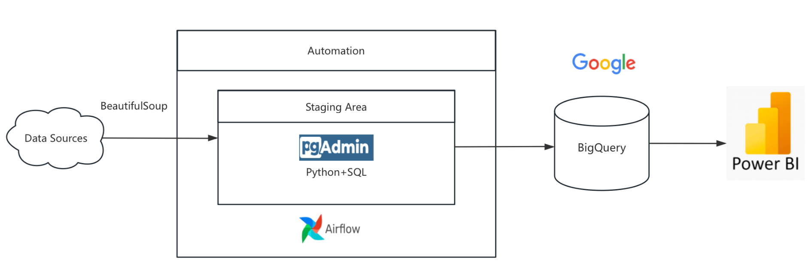

# 🌟 Premier League Data Engineering Project

A complete data engineering project for collecting, processing, and analyzing English Premier League data using Python, Airflow, PostgreSQL, BigQuery, and Docker.

---

## 📊 Project Overview

This project builds a full-stack football data pipeline. It scrapes data from reliable football sources, stores it in relational databases and cloud data warehouses, automates ETL using Airflow, and supports analysis via SQL.

---

## 🌍 Full Project Workflow

1. Select data sources (BBC & worldfootball.net)  
2. Scrape raw data using Python + BeautifulSoup (functions in `scrape.py`)  
3. Preview and verify the data structure in Jupyter Notebook  
4. Set up BigQuery & manually create partitioned tables  
5. Load transformed data to PostgreSQL and BigQuery (append mode with `ingestion_time`)  
6. Use Docker Compose to manage containers (Airflow, Postgres, Jupyter, etc.)  
7. Schedule daily/weekly scraping jobs in Airflow DAGs  
8. Analyze data directly in BigQuery using SQL  

---

## 🛠️ Data Pipeline



---

## 🔍 Data Sources

| Source | Data | Frequency |
|--------|------|-----------|
| [BBC Sport](https://www.bbc.com/sport/football/premier-league/table) | League table & top scorers | Daily |
| [worldfootball.net](https://www.worldfootball.net) | Goal data, player info, history stats | Weekly/Seasonal |

---

## 🧱 Tech Stack

- Python  
- Airflow  
- PostgreSQL  
- Google BigQuery  
- Docker  
- Jupyter Notebook  

---

## 📁 Project Structure

```
Airflow Dags/
├── init_full_load.py
├── scrape_daily_dag.py
└── scrape_weekly_dag.py
scrape.py
docker-compose.yaml
README.md
```

---

## 🕒 DAG Schedule Summary

| DAG | Script | Frequency | Description |
|-----|--------|-----------|-------------|
| Init Load | `init_full_load.py` | Manual | One-time historical load |
| Daily Scrape | `scrape_daily_dag.py` | Daily at 06:00 | league table & scorers |
| Weekly Scrape | `scrape_weekly_dag.py` | Sunday | historical/player data |

Each table includes an `ingestion_time` timestamp column for partitioning.

---

## 🚀 How to Run

### 1. Clone the repo
```bash
git clone https://github.com/yourusername/Premier-League-Data-Engineering-Project.git
cd Premier-League-Data-Engineering-Project
```

### 2. Set up Google BigQuery credentials
```bash
export GOOGLE_APPLICATION_CREDENTIALS=/path/to/key.json
```

### 3. Start services
```bash
docker-compose up -d
```

### 4. Access Airflow
Go to `http://localhost:8080`

---

## 💡 Example BigQuery Query

```sql
SELECT Name, Club, COUNT(*) as goals
FROM `project.dataset.top_scorers`
WHERE ingestion_time >= DATE_SUB(CURRENT_DATE(), INTERVAL 7 DAY)
GROUP BY Name, Club
ORDER BY goals DESC
LIMIT 5;
```

---

## 🤝 Contributing

Pull requests welcome. Submit issues or suggestions.

---

## 🧠 Author

**ZhenXIN**  
Data Engineer & Football Enthusiast ⚽

---

## 📝 License

MIT License

